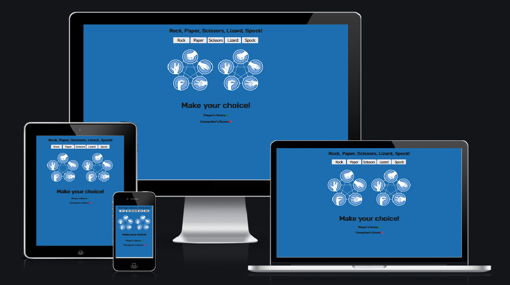
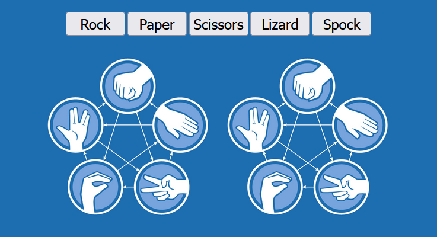
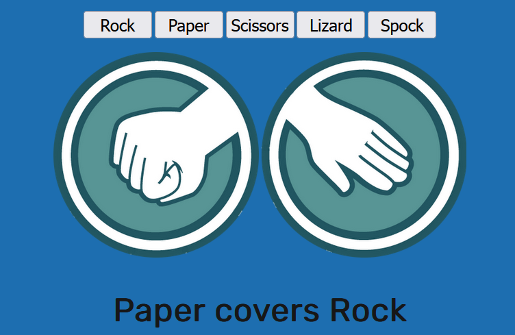
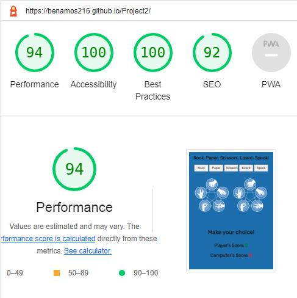

# Rock, Paper, Scissors, Lizard, Spock!

Is a single webpage containing a game of chance, scripted using Javascript. The game will allow the user to select an option, and then randomly generate a computer response and display the overall outcome and increment scores accordingly. The webpage is fully responsive, and can be used on a number of devices.

## Features

The current features that have been implemented onto the webpage, with potential future features that may be added at a later date.

### Current Features

- __Title and Main Buttons__
    - Located at the top of the page, shows the user the game name, and selection that they can make to start the game.

- __Game Area__
    - Main game area, on load up shows the possible outcomes for each selection as an image for both user and computer. As well as the selection buttons above the images.

- __Game Result__
    - As the user selects an option, the left image will change to that of an icon of their selection. The right image will then show the computer choice. Underneath that will be the outcome of the two choices. 

- __Scoring__
    - Depending on the outcome of the game, the scores will then be incremented accordingly. Tie games do not increase either score.

### Future Features

- __'Best out of'__
    - Would look to add a 'Best out of' system to the game, to determine an overall winner. This would be set to a level by the user, so they could make the game as short or long as they want. Also would include a reset button, so they can restart the game as and when they wanted.

## Testing

The webpage was tested on Mozilla Firefox, Google Chrome, and Safari on iPhone 12. Each time the page was tested for responsiveness, and functionality. Reponsiveness was tested by reducing screen width and ensuring the display was still user friendly, and easy to read without distorting the overall webpage. Functionality was tested by ensuring all buttons worked as expected. Checked that all possible outcomes were outputted correctly, and scores incremented as should be.

During this testing, scripting for the functions of the game was initially done with a switch statement. While this worked to a degree, it was not effective for displaying the relevant image for user and computer selections. This resulted in change in scripting, using 'If' statements based on the absolute truth of the user selection. 

### Validator Testing

- HTML
    - No errors were returned when passing through the official [W3C validator](https://validator.w3.org/nu/?doc=https%3A%2F%2Fbenamos216.github.io%2FProject2%2F)
- CSS
    - No errors were found when passing through the official [(Jigsaw) validator](https://jigsaw.w3.org/css-validator/validator?uri=https%3A%2F%2Fbenamos216.github.io%2FProject2%2F&profile=css3svg&usermedium=all&warning=1&vextwarning=&lang=en)
- JavaScript
    - No errors were found when passing through the official [Jshint validator](https://jshint.com/)
      - The following metrics were returned: 
      - There are 4 functions in this file.
      - Function with the largest signature take 2 arguments, while the median is 0.5.
      - Largest function has 53 statements in it, while the median is 8.
      - The most complex function has a cyclomatic complexity value of 27 while the median is 2.5.

### Unfixed Bugs

No known issues at current point of deployment.

## Deployment

- The site was deployed to GitHub pages. The steps to deploy are as follows: 
  - In the GitHub repository, navigate to the Settings tab 
  - From the source section drop-down menu, select the Master Branch
  - Once the master branch has been selected, the page will be automatically refreshed with a detailed ribbon display to indicate the successful deployment. 

The live link can be found here - https://benamos216.github.io/Project2/

## LightHouse

The webpage was run through lighthouse to determine it's overall performance, it scored the following;

    - 94 Performance
    - 100 Accessibility
    - 100 Best Practices
    - 92 SEO

## Credits

Game images from https://icon-library.com

Scripting for changing of user/computer selection image adapted from Project Portfolio > Portfolio 2 > Portfolio Project Scope video.

Favicon generated by https://favicon.io/
